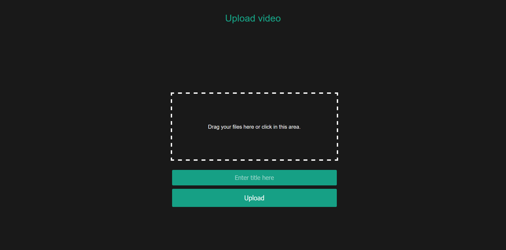
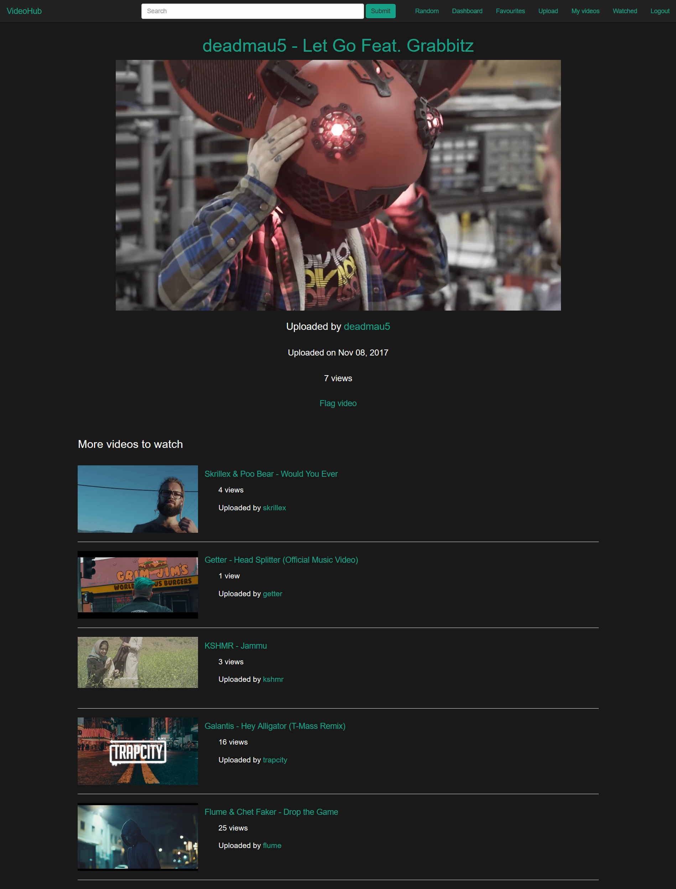
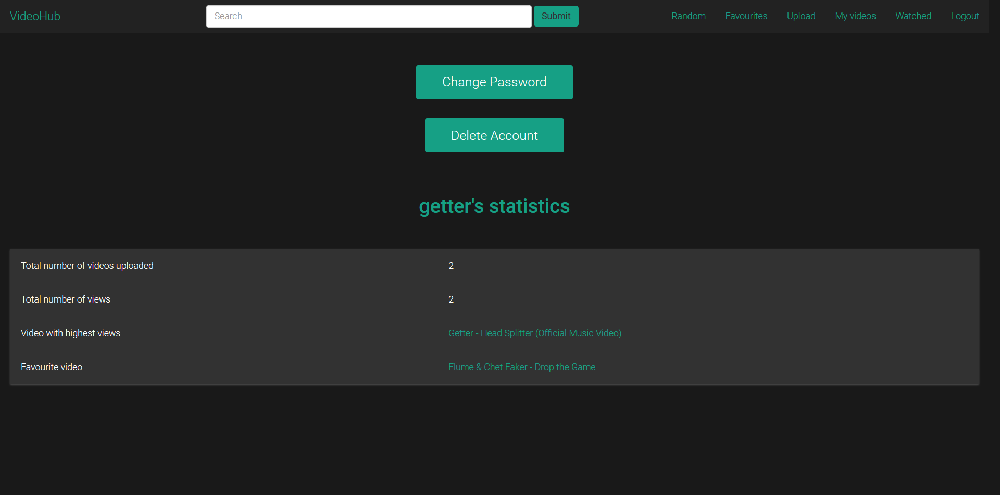
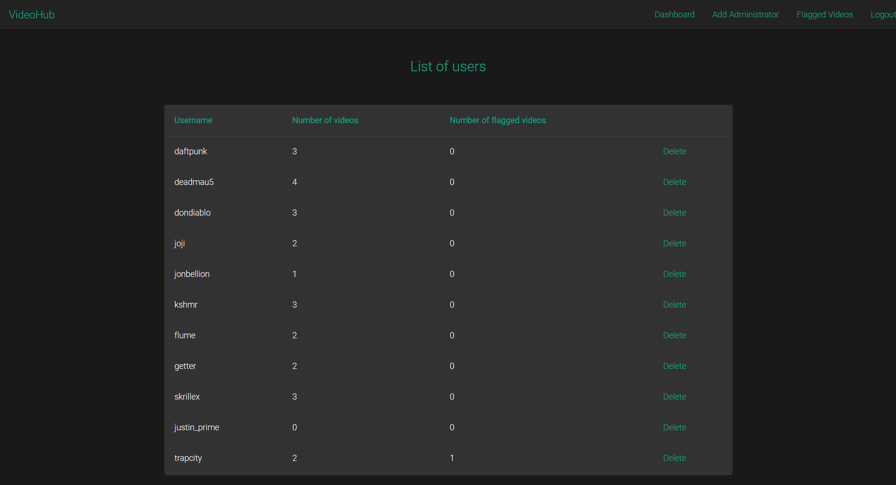

# VideoHub
A video sharing platform.
A rough client-server architecture replica of YouTube with Flask and MySQL.

###### All CSS files are available offline.

### Requirements

To install the requirements,
```bash
pip install -r requirements.txt
```

### Starting server

To start server,
```bash
python3 ./Server/server.py
```

### Starting client

To start client,
```bash
python3 ./Client/client.py
```


## You're done!

Visit http://127.0.0.1:5000

# Screenshots

## Normal user

#### Homepage


#### Login / Signup Page


#### Video Search Page


#### Upload Page


#### Video Page


#### Video Page Full Screen


#### Dashboard


### Administrator

#### Flagged Video List


#### Users List

